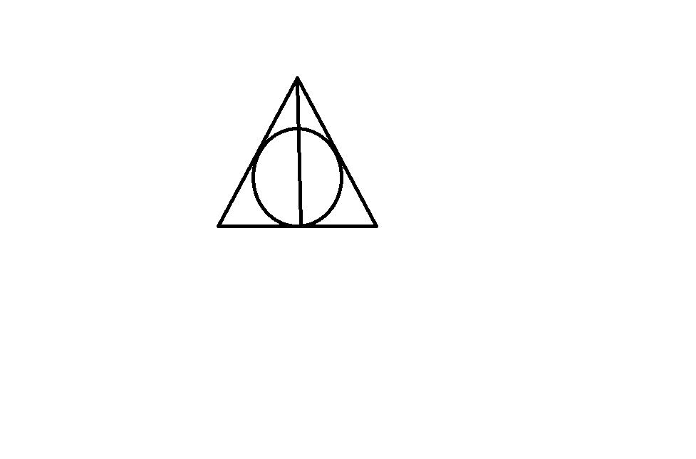

Most Popular Conspiracies
=========================

The God Complex
---------------

The first theory is that Dumbedore is god. 
Parallels to Christianity in the Harry Potter series include two tombstones. 
Harry and Hermione discover two quotes from the bible on two significant
tombstones. The first quote is from Matthew 6:21. "For where your treasure is, 
there will your heart be also.” This means that one needs to keep heaven as 
their treasure and there is where the heart will be. This quote is found on 
Ariana and Kendra’s graves. No matter the story on how they died, it is clear 
that Dumbledore is tremendously hurt by their deaths. This points to an even 
greater discussion about Dumbledore and his morals. Did he pick the quote? 
If so, was it meant for treasuring family or heaven? The second quote however, 
is much more complex. This quote is found in 1 Corinthians 15:26.
“The last enemy to be destroyed is death.” This quote was found on 
Harry’s parents’ grave. Harry is suddenly confused about this quote and who 
might have picked it out. He thinks as though it is a reference to death eaters
at first. Later, Harry finds out that not only does he have to face Voldemort, 
but he has to sacrifice his life to destroy another Horcrux within himself. 
This sacrifice brings the quote a meaning of Harry ultimately facing the 
reality of death. Harry battles this decision repeatedly but discovers that 
this is the only way to save the world and destroy Voldemort’s evil. 
By battling the death inflicted upon him, Harry is resurrected and is able to
completely conquer death. Even if Hermione believes it means life after death, 
this quote is much more important than that. It is important to understand when
Harry dies in the Forbidden Forest, Harry greets Dumbledore and does not greet ‘death’. 
Therefore, Harry has conquered death and by doing so he is resurrected. 
Christians have battled with the series as it does include a form of magic 
and witchcraft. In this chapter of the bible, it describes all who have been 
resurrected after death. Essentially meaning as long as Jesus is resurrected, 
there is chance for resurrection in the eternal life. This points to life after death. 
Although, they should be excited about the new idea that Harry Potter is seen as a christ-like figure in the series.

Dumbledore is Death
-------------------

*The Tale of the Three Brothers* is important in the final book
 and in the whole series really. The tale begins with three brothers. 
 The three brothers show remarkable items placed in the wizarding world by death. 
 The eldest brother is given the elder wand (power). The middle brother is given 
 a resurrection stone to bring back the dead. While the youngest brother asks
for an item in which death will not be able to follow him (invisibility cloak). 
If one obtained all three of these they would become the master of death. 
In the first book, Dumbledore gave Harry the invisibility cloak. Dumbledore 
had the elder wand since he won it from Grindlewald. In the final book Dumbledore 
hides the ressurection stone in the snitch that he gives Harry in his will. 
When Harry dies, he greets Dumbledore (death) as an old friend instead of a painful sad thing.
Therefore, Dumbledore is death.

=======================================  =====================================
People in the Group Favoring God Theory  People in Group Favoring Death Theory
=======================================  =====================================
2 people                                 2 people
=======================================  =====================================