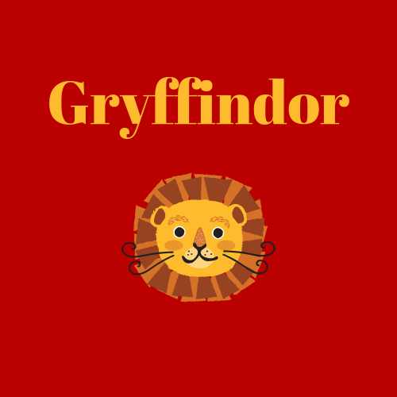

Gryffindor
==========

Overview
--------

The Hogwarts School of Witchcraft and Wizardry's house of **Gryffindor** is the home 
to Harry Potter himself along with some of his best friends, Ron Weasley and 
Hermione Granger. Gryffindor was founded by Godric Gryffindor long ago. Only those
who value courage, chivalry and determination would be chosen by the Sorting Hat
to join the house. The crest symbol of Gryffindor is a lion and the colors are
scarlet and gold. Minerva McGonagall is the head of the house, and Nearly Headless
Nick is the house ghost.

Gryffindor's element is fire which was the inspiration for making the colors 
scarlet and gold to represent the house. Fire also relates back to the lion symbol
with the scarlet color representing the mane and tail and the gold representing
the coat.

**Traits of a Gryffindor**

* Bravery
* Nerve
* Courage
* Chivalry
* Determination

*You might belong in Gryffindor,
where dwell the brave at heart,
their daring, nerve and chivalry
set Gryffindors apart*
- The Sorting Hat

Gryffindors have shared a rivalry with the Slytherins ever since their founders,
Godric Gryffindor and Salazar Slytherin, had a severe disagreement about Slytherin's
stance on blood purity. Usually, Gryffindor does not have any issues with the houses
of Ravenclaw and Hufflepuff. Dumbledore's Army included Gryffindors, Hufflepuffs
and Ravenclaws.

Dumbledore's Army
------------------

================   =================
Name               House
================   =================
Harry Potter       Gryffindor
Luna Lovegood      Ravenclaw
Hannah Abbott      Hufflepuff
Colin Creevey      Gryffindor
Zacharias Smith    Hufflepuff
Michael Corner     Ravenclaw
================   =================

Fun Facts
----------

**The Sword of Gryffindor** is a notable item in the story. It is said to be a gleaming
silver sword made of goblin-forged steel with a ruby-studded hilt. It is a powerful
weapon that presents itself to worthy Gryffindors in times of need.

Some notable members of the Gryffindor house include Neville Longbottom, Remus Lupin,
Sirius Black, Albus Dumbledore, Rubeus Hagrid, the Weasley family and the Potter 
family, excluding Albus Potter.

The Gryffindor Common Room is guarded by a painting of the Fat Lady who allows entry
to the common room only after she is given the correct password. Beyond the common
room are the boys' and girls' dormitories. The common room is used for studying,
celebrating or just relaxing with friends.

To learn more about the Wizarding World of Harry Potter, 
visit `Pottermore <https://www.pottermore.com/>`_

  

