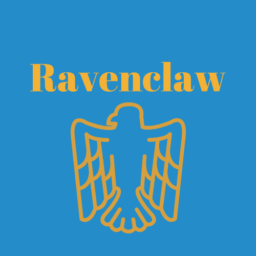

Ravenclaw
============

Overview
---------

The Hogwarts School of Witchcraft and Wizardry's house of **Ravenclaw** was founded by
Rowena Ravenclaw and values wit, learning and wisdom above all. The crest symbol
of Ravenclaw is the Eagle and the colors are blue and bronze. The head of the 
Ravenclaw house is Filius Flitwick and the house ghost is the Grey Lady, also 
known as Helena Ravenclaw. Ravenclaw's element is air. This relates to the house
colors as blue represents the sky and bronze represents eagle feathers.

**Traits of a Ravenclaw**

* Wit
* Learning
* Wisdom

*Or yet in wise old Ravenclaw,
if you've a ready mind,
Where those of wit and learning,
will always find their kind*
- The Sorting Hat

Fun Facts
----------

Many Ravenclaws tend to be academically gifted students, hard-workers and diligent.
They are also known to be curious, logical, rational and attentive to the world
around them. This may sound like Hermione Granger, a talented and academic-focused
witch, but she was destined for Gryffindor. The sorting hat did consider Ravenclaw
as an option for Hermione.

Ravenclaws are generally eccentric and charming people who think outside the box.
Ravenclaws speak their mind and can be heard making blunt or matter-of-fact
statements at times.

Ravenclaw has little rivalry among the other houses in comparison to the Slytherin
and Gryffindor rivalry, except in Quidditch, of course. The common room for 
Ravenclaw is the Ravenclaw Tower, and it is full of tables, chairs and bookcases.
A riddle given by a bronze eagle statue must be answered to enter the tower.

**Rowena Ravenclaw's diadem** is a tiara said to grant wisdom to the person wearing 
it. It was lost for centuries before it became a Horcrux by Lord Voldemort. It 
was later destroyed by Fiendfyre.

Some notable Ravenclaws include Luna Lovegood, Sybill Trelawney, Cho Chang,
Gilderoy Lockhart, Quirinus Quirrell and Garrick Ollivander.

*Wit beyond measure is a man's greatest treasure*
- Rowena Ravenclaw

To learn more about the Wizarding World of Harry Potter, 
visit `Pottermore <https://www.pottermore.com/>`_